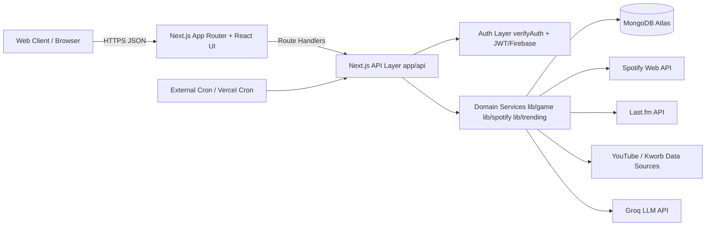
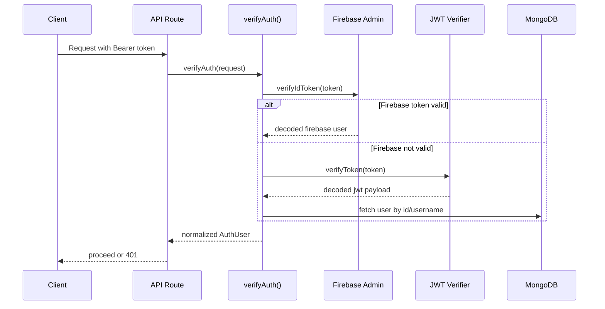
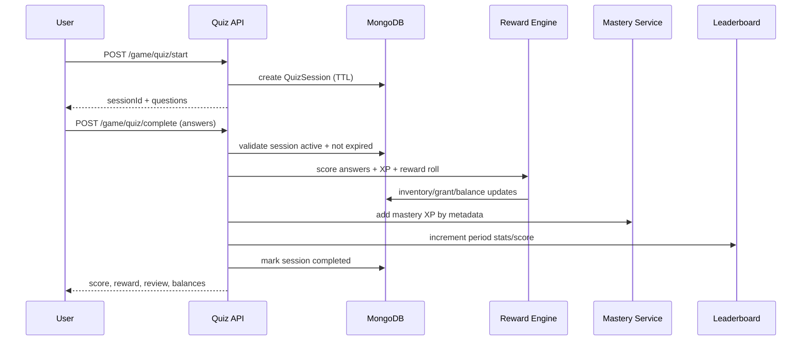
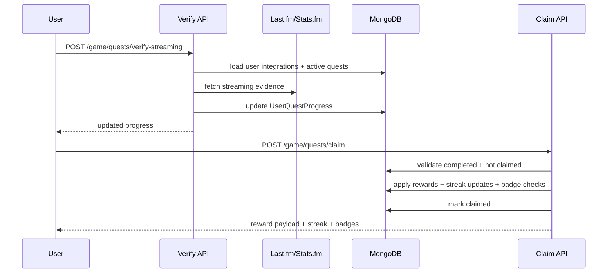
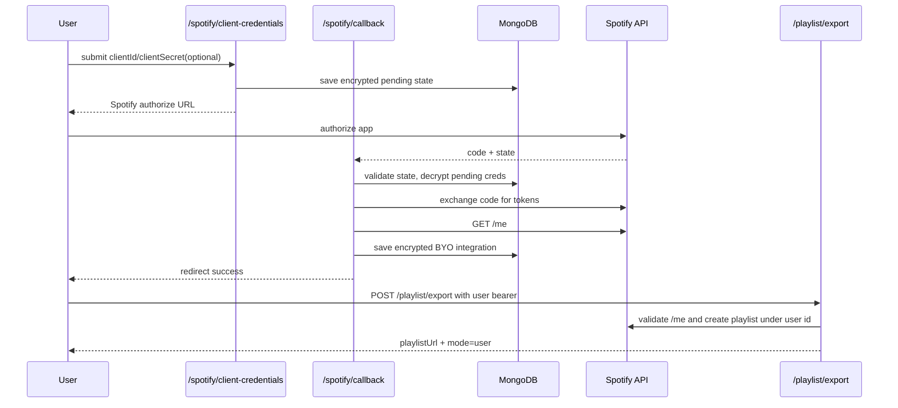

# ArmyVerse Comprehensive System Design

> A full production-style system design covering architecture, data model, critical flows, security, scaling, reliability, and evolution strategy.

---

## Document Metadata

| Field | Value |
|---|---|
| System | ArmyVerse |
| Primary Stack | Next.js 14 + TypeScript + MongoDB + Mongoose |
| Auth Model | Dual auth: Firebase ID token + App JWT |
| Core Domains | Game (quiz/quests/mastery), Playlist, Spotify integration, Trending data, Blogs |
| Deployment Target | Vercel (Node runtime API routes) |
| Source Roots | `Documents/ARMYVERSE/app`, `Documents/ARMYVERSE/lib`, `Documents/ARMYVERSE/docs` |

---

## 1. System Vision and Product Goals

ArmyVerse is a fan-engagement platform with a game loop built around BTS content and music behavior. It combines:

- gameplay loops (quiz, rewards, collection, mastery, leaderboard)
- music integrations (Spotify + Last.fm verification)
- creator/community surface (blogs, collections)
- analytics/trending signals (Spotify + YouTube snapshot aggregation)

### 1.1 High-Level Product Goals

1. Increase user retention through daily/weekly progression loops.
2. Keep reward economy fair and auditable.
3. Integrate external music data without degrading UX when providers fail.
4. Support social features and content growth beyond only game mechanics.
5. Maintain fresher-friendly development speed with modular architecture that can scale.

### 1.2 Success Metrics (Recommended)

- D1/D7 retention by cohort
- Daily quest completion rate
- Claim success rate and duplicate-claim rejection rate
- Leaderboard engagement (view events, rank changes, period participation)
- Playlist export success by mode (`user`, `owner` fallback)
- Verification success rate for streaming quests

---

## 2. Requirements

## 2.1 Functional Requirements

1. User authentication via JWT or Firebase token.
2. Quiz lifecycle: start session -> submit answers -> score -> rewards.
3. Inventory and crafting system using dust economy.
4. Mastery progression with badges and level milestone rewards.
5. Daily/weekly quest generation and claim pipeline.
6. Streaming quest verification through Last.fm/Stats.fm integrations.
7. Leaderboards across `daily`, `weekly`, `alltime` periods.
8. Spotify OAuth flows (standard + BYO app credentials).
9. Playlist export to Spotify in user mode with owner fallback mode.
10. Trending cache generation from external data snapshots.
11. Blog and collection APIs for content/community features.

## 2.2 Non-Functional Requirements

1. API correctness for reward and claim logic (no duplicate side-effects).
2. Reasonable interactive latency for core flows (quiz complete, quest claim, export).
3. External provider failures should degrade gracefully.
4. Security for token handling and BYO secret storage.
5. Observability to debug multi-step failures quickly.
6. Ability to evolve into async/distributed model when traffic increases.

## 2.3 Key Constraints

- Current backend is integrated inside Next.js API route layer.
- External API dependence (Spotify, Last.fm, scraping sources) introduces variable latency.
- Serverless/runtime limits on hosted environment.
- Some workflows currently run synchronously and can become hotspots at scale.

---

## 3. Architecture Strategy

ArmyVerse uses a **modular monolith** design:

- single deployable application
- clear domain modules in `lib/`
- API route handlers in `app/api/`
- shared persistence layer (MongoDB)

This is a strong design for current team size and velocity because it avoids distributed-systems overhead while preserving logical boundaries for future extraction.

## 3.1 Macro Architecture (Container View)

## 3.2 Runtime Characteristics

- Most critical routes set `runtime = 'nodejs'`.
- Dynamic routes used where needed (`dynamic = 'force-dynamic'`).
- Vercel function max duration configured in `vercel.json`.
- Certain scheduled jobs run through authenticated cron endpoints.

---

## 4. Domain Decomposition

## 4.1 Core Domains

| Domain | Responsibility | Key Files |
|---|---|---|
| Auth | Token verification, user identity normalization | `lib/auth/verify.ts`, `lib/auth/jwt.ts` |
| Game Engine | Quiz scoring, rewards, inventory, mastery, quests, leaderboard | `lib/game/*`, `app/api/game/*` |
| Spotify Integration | OAuth standard + BYO, status, token refresh, exports | `app/api/spotify/*`, `app/api/playlist/export/route.ts`, `lib/spotify/userTokens.ts` |
| Trending Pipeline | Snapshot processing and homepage cache generation | `app/api/trending/*`, `lib/models/*Snapshot*` |
| Content Platform | Blogs, comments, reactions, collections | `app/api/blogs/*`, `app/api/collections/*` |
| User Profile & Integrations | User profile and service connections | `app/api/user/*`, `lib/models/User.ts` |

## 4.2 Game Subdomains

| Subdomain | Responsibility | Primary Persistence |
|---|---|---|
| Quiz Sessions | short-lived quiz state, answer submission validity | `QuizSession` |
| Reward Distribution | card drops, duplicate dust conversion, balance updates | `InventoryItem`, `UserGameState`, `InventoryGrantAudit` |
| Mastery | member/era/OT7 XP and level milestones | `MasteryProgress`, ledger models |
| Quest Lifecycle | generation, progress, verification, claim | `QuestDefinition`, `UserQuestProgress` |
| Leaderboard | per-period score + stats + rank | `LeaderboardEntry` |
| BoraRush Bridge | handoff token and run completion awards | `BoraRushRun`, `BoraRushDailyLimit` |

---

## 5. Detailed Component Design

## 5.1 Authentication Component

### Inputs

- `Authorization: Bearer <token>` in API requests

### Behavior

1. `verifyAuth()` checks bearer token.
2. Tries Firebase Admin verification first (if configured).
3. Falls back to JWT verification.
4. Normalizes auth context into common `AuthUser` shape.
5. `getUserFromAuth()` resolves canonical user document.

### Security Notes

- JWT secret is mandatory (`JWT_SECRET`).
- Firebase Admin initialization only if service credentials exist.
- Avoids trust on client-submitted user IDs in critical flows.

## 5.2 Quiz Engine Component

### Start Flow (`/api/game/quiz/start`)

- validates request with `zod`
- samples questions via `selectQuestions`
- creates session with expiration (+20 minutes)
- returns questions without answer index

### Complete Flow (`/api/game/quiz/complete`)

- validates active, non-expired session
- scores with difficulty-weighted XP (`scoreWithBreakdown`)
- applies reward gating (XP threshold)
- handles duplicate conversion to dust
- updates mastery by correctly answered question metadata
- advances quest progress
- updates leaderboard stats/level metadata

## 5.3 Quest + Verification Component

### Generation

- daily and weekly cron routes call `ensure*StreamingQuests` and `ensure*QuizQuests`
- protected by cron secret (or disabled for local debugging)

### Verification

- `/api/game/quests/verify-streaming` checks connected service
- runs `verifyAllStreamingQuests()`
- syncs progress based on scrobble evidence

### Claim

- `/api/game/quests/claim` validates completion and non-claimed state
- awards XP/dust/ticket-based card grants
- updates streaks and completion badges

## 5.4 Leaderboard Component

- supports `daily`, `weekly`, `alltime`
- lazy rank recomputation per request for target period
- tracks stats (`quizzesPlayed`, `questionsCorrect`, `totalQuestions`)
- backfills all-time entry from user XP when missing/inconsistent

## 5.5 Spotify Integration Component

### Standard OAuth

- signed `state` flow
- token exchange with centralized app credentials
- stores integration tokens in user document

### BYO OAuth

- accepts user-provided client credentials
- optional PKCE when client secret absent
- stores pending BYO state encrypted
- callback exchanges code and persists encrypted token set

### Token Lifecycle

- `/api/spotify/status` prefers BYO integration when available
- validates refresh token and refreshes access token on demand
- emits status for UX decisions (connected/reconnect required)

### Export Modes

- `user` mode: valid user bearer token -> writes playlist to user Spotify account
- `owner` mode: no user token -> uses owner refresh token and owner account
- invalid user bearer returns `401` unless explicit fallback path enabled

## 5.6 Trending Data Component

- consumes latest kworb-derived snapshots for Spotify and YouTube
- builds normalized homepage cache document
- cron endpoint invokes cache build route on schedule
- keeps rolling cache versions and prunes old entries

---

## 6. Data Architecture

## 6.1 Persistence Technology

- MongoDB Atlas
- Mongoose ODM models in `lib/models`

## 6.2 Collection Inventory (Grouped)

### Identity and Profile

- `users`
- `userbadges`

### Game Runtime

- `quizsessions`
- `questions`
- `usergamestate`
- `inventoryitems`
- `inventorygrantaudit`
- `borarushruns`
- `borarushdailylimits`

### Progression and Quests

- `questdefinitions`
- `userquestprogress`
- `masteryprogress`
- `masteryrewardledgers`
- `masterylevelrewardledgers`
- `leaderboardentries`
- `badges`

### Content and Music Metadata

- `tracks`
- `albums`
- `playlists`
- `fandom_gallery_images` (photocard catalog)
- `collections`
- `blogs`

### Analytics and Caches

- `kworbsnapshots`
- `youtubekworbsnapshots`
- `homepagetrendingcaches`
- `streamingcache`

## 6.3 Consistency Patterns

1. **Idempotency-by-state** for quest claim (`claimed` guards).
2. **Uniqueness-by-business-key** for one-time awards through ledger/audit records.
3. **Atomic increment updates** for score/stat/balance where possible.
4. **Compensating checks** on read paths (all-time backfill in leaderboard).

## 6.4 Suggested Index Priorities

1. `LeaderboardEntry(periodKey, score desc, lastPlayedAt)`
2. `UserQuestProgress(userId, code, periodKey)` unique
3. `InventoryItem(userId, cardId)`
4. `QuestDefinition(code)` unique, plus period/active filters
5. `User(firebaseUid)`, `User(email)`, `User(username)`

---

## 7. API Design

## 7.1 API Topology

ArmyVerse groups endpoints by domain in `app/api/`.

| Group | Example Endpoints |
|---|---|
| Auth | `/api/auth/signup`, `/api/auth/signin` |
| Game | `/api/game/quiz/*`, `/api/game/quests/*`, `/api/game/leaderboard/*`, `/api/game/mastery/*` |
| Playlist | `/api/playlist/generate`, `/api/playlist/export` |
| Spotify | `/api/spotify/callback`, `/api/spotify/status`, `/api/spotify/client-credentials` |
| User | `/api/user/profile`, `/api/user/integrations`, `/api/user/export-data` |
| Content | `/api/blogs/*`, `/api/collections/*` |
| Trending/Cron | `/api/trending/homepage-cache`, `/api/cron/daily-quests`, `/api/cron/weekly-quests` |

## 7.2 Response Design Patterns

- mostly JSON payloads with explicit error messages
- domain-specific response payloads include rich context (review breakdown, rank metadata, export mode)
- status codes generally aligned with auth/validation/resource semantics

## 7.3 Contract Reliability Notes

- Game APIs should preserve strict backward compatibility on reward/leaderboard payload fields.
- Export mode field (`user` vs `owner`) is critical for product correctness and user trust.
- Consider explicit versioning if API consumers increase.

---

## 8. Critical End-to-End Flows

## 8.1 Unified Authentication Flow

## 8.2 Quiz Completion and Reward Flow

## 8.3 Streaming Quest Verify + Claim

## 8.4 Spotify BYO OAuth + Export

---

## 9. Security Architecture

## 9.1 Threat Model (Primary)

1. Token misuse or cross-account action attempts.
2. OAuth state tampering / callback replay attempts.
3. Sensitive BYO credentials exposure at rest.
4. Duplicate claim/replay abuse in game economy.
5. External API abuse and quota exhaustion.

## 9.2 Implemented Controls

| Threat | Control |
|---|---|
| Unauthorized API access | `verifyAuth` gate in protected routes |
| JWT forgery | mandatory `JWT_SECRET` signing/verification |
| OAuth CSRF | state validation and HMAC-signature checks |
| BYO secret leakage from DB dumps | AES-256-GCM encryption via `lib/utils/secrets.ts` |
| Duplicate quest claims | claim-state checks + business-key semantics |
| Expired user token export misuse | user bearer validation (`/v1/me`) + explicit 401 path |
| Cron abuse | `CRON_SECRET` validation on cron routes |

## 9.3 Security Gaps / Hardening Opportunities

1. Enforce BYO pending-state expiry window server-side strictly.
2. Centralize authorization policy checks to reduce route-level drift.
3. Add structured security audit logs for sensitive actions.
4. Add abuse/rate controls at gateway for expensive endpoints.
5. Add automated negative security tests (BOLA, replay, auth bypass).

---

## 10. Reliability and Failure Handling

## 10.1 Reliability Patterns Present

- guarded validation with clear 4xx/5xx split
- defensive token refresh and mode fallback behavior
- explicit duplicate and claim-state protections
- leaderboard backfill logic for eventual consistency corrections

## 10.2 Known Failure Modes

| Failure Mode | Impact | Current Behavior | Recommended Next Step |
|---|---|---|---|
| Last.fm unavailable | quest verify failure | verification endpoint error | provider circuit breaker + retry queue |
| Spotify token revoked | export/user mode failure | returns reconnect status / 401 | proactive reauth alerts in UI |
| Slow external provider | latency spikes | synchronous waits | async job mode for heavy workflows |
| Rank update on read heavy load | leaderboard latency | lazy rank recomputation | periodic async rank materialization |
| Partial write in complex reward flow | state mismatch risk | idempotent checks reduce blast radius | tighter transaction boundaries for critical multi-write paths |

## 10.3 Idempotency and State-Safety

- session state prevents quiz replay (`active` -> `completed`/`expired`)
- quest claim checks `claimed` flag before reward write
- BoraRush run IDs used for duplicate submission detection
- leaderboard updates use deterministic period keys

---

## 11. Performance and Scalability Design

## 11.1 Current Scaling Shape

Strong at low-mid scale due to simple architecture and fast iteration.
Potential bottlenecks at high scale:

1. external dependency-heavy synchronous routes
2. heavy read-modify-write endpoints
3. rank recalculation inside request path
4. in-memory-only controls that do not coordinate across instances

## 11.2 Scaling Plan (Phased)

### Phase 1: Instrumentation + Hotspot Tuning

- endpoint p95/p99 metrics
- top query profiling and index tuning
- response payload trimming where needed

### Phase 2: Async Offload

- move rank recomputation and expensive cache builds to worker jobs
- decouple heavy verification retries from user request cycle

### Phase 3: Distributed Controls

- distributed rate limiter for provider quotas
- queue-backed retry + dead-letter for external failures

### Phase 4: Bounded Service Extraction

- optional split by domain: Game, Spotify/Playlist, Content, Trending
- keep shared identity and event contracts stable

---

## 12. Observability and Operations

## 12.1 Must-Have Telemetry

1. request latency and error rate by route
2. provider call success/failure and latency (Spotify, Last.fm, scraping)
3. reward claim conflict/duplicate metrics
4. token refresh success/failure rates
5. cron run success and freshness age of derived caches

## 12.2 Logging Standards (Recommended)

- include correlation id/request id
- include `userId` (where safe), `operation`, `mode`, `periodKey`
- avoid logging secrets/tokens/raw credentials
- structured JSON logs for searchable incident triage

## 12.3 Runbook Triggers

- claim success rate drop > threshold
- export failure spike by mode
- quest verification error spike
- stale homepage cache beyond acceptable freshness window

---

## 13. Deployment and DevOps

## 13.1 Deployment Topology

- single Next.js app deployed on Vercel
- API routes co-located with frontend in same project
- MongoDB Atlas as managed datastore
- scheduled jobs via Vercel cron and/or authenticated external cron callers

## 13.2 Environment Management

Critical variables include:

- `MONGODB_URI`
- auth + JWT secrets
- Firebase Admin credentials
- Spotify app credentials + BYO encryption key
- Last.fm API credentials
- cron secrets and base URL

## 13.3 CI/CD and Release Maturity (Recommended)

1. enforce lint + type-check + unit tests on PR.
2. include integration tests for auth/claim/export critical paths.
3. staged deploy with smoke checks before full rollout.
4. rollback strategy documented for high-risk changes.

---

## 14. Testing Strategy

## 14.1 Test Layers

- unit tests for deterministic game logic (scoring, mastery, rewards)
- integration tests for API + DB + auth behaviors
- end-to-end tests for key user journeys

## 14.2 Highest-Value E2E Cases

1. quiz start -> complete -> reward -> leaderboard update
2. quest verify -> claim -> streak + badge award
3. Spotify connect -> export in user mode
4. expired user token export -> reconnect or fallback behavior

## 14.3 Non-Functional Testing

- load test top hot endpoints
- replay/duplicate claim race tests
- failure-injection tests for provider outages

---

## 15. Tradeoffs and Design Rationale

## 15.1 Why Modular Monolith Works Here

- lower operational burden
- faster product iteration
- easier onboarding for small team/fresher workflow
- still allows clean boundaries by domain modules

## 15.2 Main Tradeoffs

- shared runtime means noisy-neighbor risk between domains
- synchronous API chains can increase tail latency
- dependency failures can affect request paths directly

This is acceptable for current stage, provided a clear hardening roadmap exists.

---

## 16. Technical Debt Register

| Area | Debt | Priority |
|---|---|---|
| Leaderboard rank updates | computed in request path | High |
| Distributed rate limiting | local/in-route patterns not globally coordinated | High |
| Security observability | needs richer audit trail for sensitive actions | High |
| Async workflows | some heavy paths still synchronous | High |
| Contract governance | explicit API versioning strategy not formalized | Medium |
| Provider fallback policies | needs stronger policy consistency across routes | Medium |

---

## 17. Evolution Roadmap (90-Day Practical)

## Sprint 1-2

1. Structured telemetry and dashboard baseline.
2. Critical endpoint latency and failure profiling.
3. Security event logging for auth/export/claim.

## Sprint 3-4

1. Move rank recomputation and heavy cache rebuilds to async workers.
2. Add distributed limiter and provider-aware retry policies.
3. Add integration tests for high-risk reward and export flows.

## Sprint 5-6

1. Introduce event contracts for reward and progression changes.
2. Build incident runbooks and on-call style response checklists.
3. Evaluate service extraction boundaries only if metrics justify.

---

## 18. Interview Defense Summary (Short)

If asked to explain this architecture quickly:

1. ArmyVerse is a modular monolith optimized for delivery speed and domain clarity.
2. It has strict identity checks, stateful game progression, and Spotify/Last.fm integrations.
3. It protects reward correctness with idempotent state guards and ledger-style tracking.
4. It already supports advanced OAuth patterns (standard + BYO with encrypted secrets).
5. The next maturity steps are async heavy workflows, distributed controls, and deeper observability.

---

## 19. File-Level Architecture Map

### Core Paths

- `Documents/ARMYVERSE/app/api/game/*`
- `Documents/ARMYVERSE/app/api/spotify/*`
- `Documents/ARMYVERSE/app/api/playlist/export/route.ts`
- `Documents/ARMYVERSE/app/api/cron/*`
- `Documents/ARMYVERSE/app/api/trending/*`
- `Documents/ARMYVERSE/lib/auth/*`
- `Documents/ARMYVERSE/lib/game/*`
- `Documents/ARMYVERSE/lib/spotify/*`
- `Documents/ARMYVERSE/lib/models/*`
- `Documents/ARMYVERSE/docs/architecture/*`

---

## 20. Final Design Verdict

ArmyVerse has a strong, interview-worthy architecture with real production concerns already handled: multi-auth identity, complex game-state transitions, secure integration storage, and external-provider orchestration. The design is practical for current stage and is one disciplined hardening cycle away from stronger production readiness.
