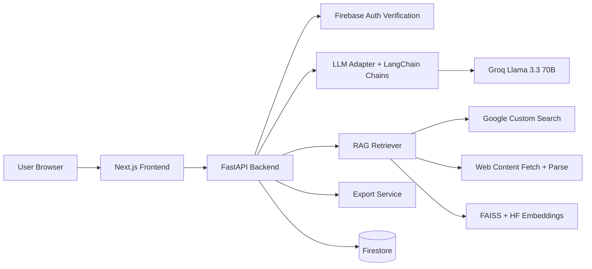
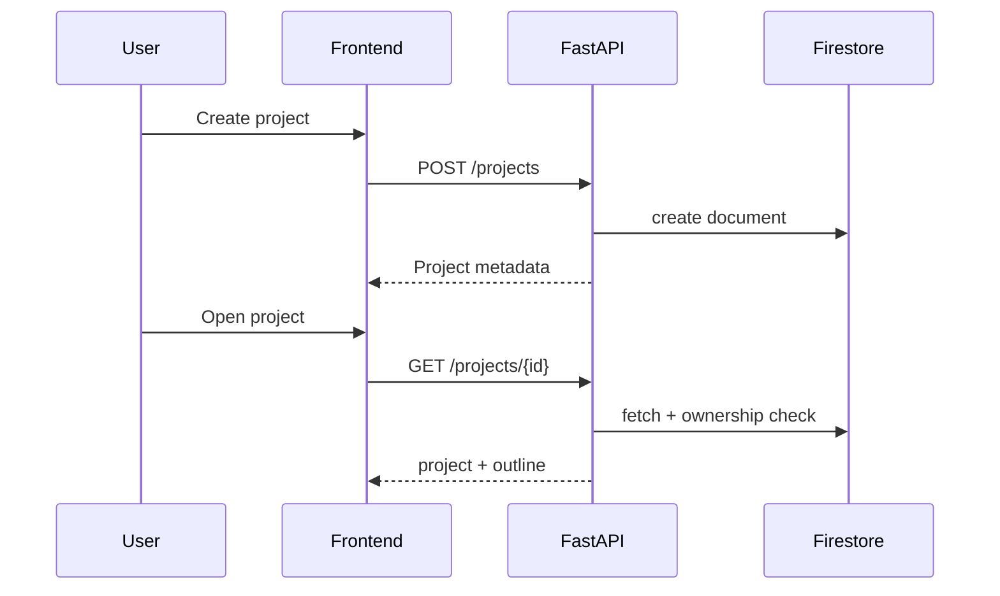
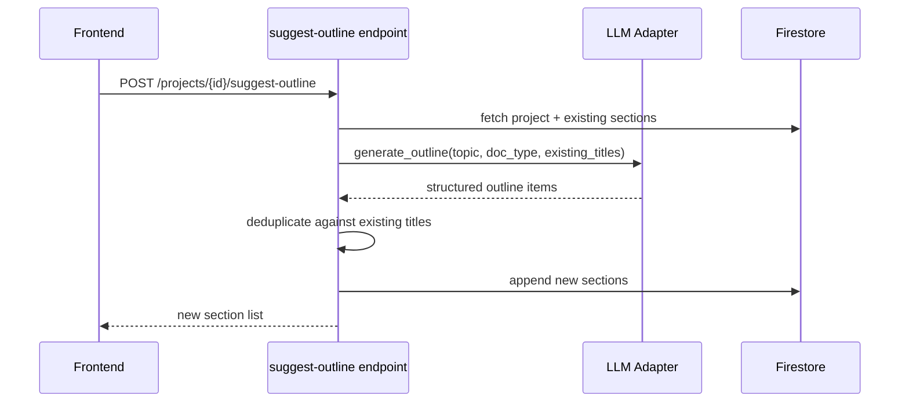
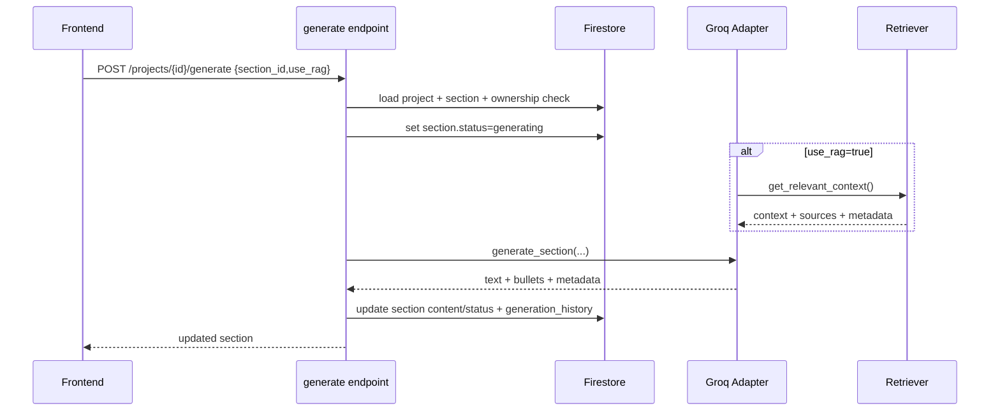
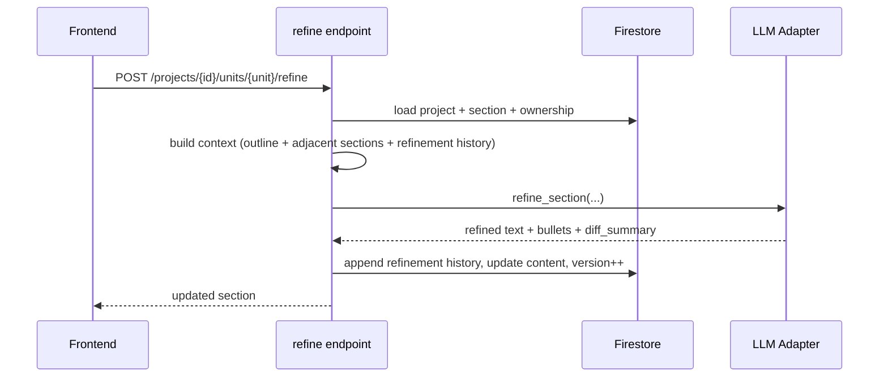
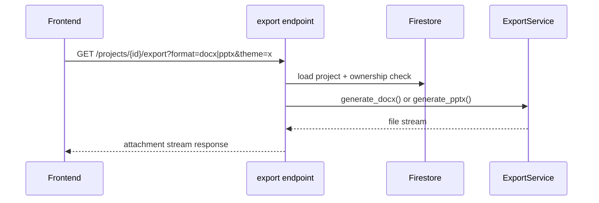

# DocBuilder Comprehensive System Design

> A deep end-to-end architecture document for DocBuilder, covering product intent, AI pipeline design, backend internals, data model, security, reliability, deployment, and scaling evolution.

---

## Document Metadata

| Field | Value |
|---|---|
| System | DocBuilder |
| Primary Stack | FastAPI + Python + Firestore + Next.js |
| AI Stack | LangChain + Groq Llama 3.3 70B + optional RAG (Google Search + FAISS + MiniLM embeddings) |
| Key Outputs | DOCX and PPTX exports with themed rendering |
| Deployment | Backend on Railway/Render-style setup, frontend on Vercel |
| Source Roots | `Documents/docbuilder/backend`, `Documents/docbuilder/frontend`, `Documents/docbuilder/docs` |

---

## 1. System Vision and Product Goals

DocBuilder is an AI-assisted document production platform. It is not only a text generator; it is a complete structured writing workflow:

1. project and outline orchestration
2. section-wise generation
3. iterative, context-aware refinement
4. export-ready professional output (DOCX/PPTX)

### 1.1 Product Objectives

1. Reduce document creation time while preserving structure quality.
2. Improve output quality with optional retrieval-grounded generation.
3. Keep editing iterative and explainable through refinement history.
4. Offer final outputs in business-ready formats.
5. Preserve simple and fast UX for students/freshers while retaining production-like architecture.

### 1.2 Success Metrics (Recommended)

- time-to-first-outline
- time-to-first-complete-draft
- section generation success rate
- refinement acceptance ratio (low manual rewrite means better quality)
- export success rate by format/theme
- p95 latency for suggest/generate/refine/export endpoints

---

## 2. Requirements

## 2.1 Functional Requirements

1. Firebase-authenticated users can create/manage projects.
2. AI can suggest outline sections by topic and document type (`docx`/`pptx`).
3. AI can generate section content with optional RAG.
4. Users can refine sections with contextual and history-aware prompts.
5. Users can comment on sections and react to refinements.
6. Users can reorder, add, delete sections.
7. Users can export project to DOCX or PPTX with theme options.

## 2.2 Non-Functional Requirements

1. Structured and reliable AI response parsing.
2. Data isolation by project owner.
3. Graceful failure on model/retrieval/export errors.
4. Stable output formatting in document exports.
5. Operational observability on AI latency/failure hotspots.
6. Extensible architecture for future provider/model changes.

## 2.3 Constraints

- AI latency and provider availability are external dependencies.
- Current generation/refinement path is synchronous request/response.
- RAG retrieval quality depends on search source quality and network reliability.
- Firestore document growth can become a scaling concern for large outlines/history.

---

## 3. Architecture Strategy

DocBuilder uses a **three-tier architecture** with a modular service layout inside backend.

### 3.1 Why This Architecture Fits

1. Fast shipping with clear separations (`api`, `core`, `db`, `services`).
2. Controlled AI interfaces through adapter pattern and Pydantic schemas.
3. RAG remains optional per section (cost/performance control).
4. Export concerns isolated from generation concerns.

---

## 4. Component-Level Design

## 4.1 Frontend Layer (Next.js)

Responsibilities:

- auth session and token acquisition via Firebase SDK
- project and section management UI
- generation/refinement/export actions
- section editing and ordering UX (DND + rich editor)

Key characteristics:

- Next.js + React + TypeScript
- TipTap for rich text editing
- DnD kit for section ordering
- API integration through HTTP calls to FastAPI backend

## 4.2 API Layer (FastAPI)

Responsibilities:

- request validation and ownership checks
- orchestration for generation and refinement
- Firestore persistence
- export streaming responses

Key routes from `backend/app/api/endpoints.py`:

| Category | Endpoints |
|---|---|
| Auth/Profile | `/auth/register`, `/auth/save-profile`, `/auth/profile` |
| Project CRUD | `/projects`, `/projects/{project_id}`, `/projects/{project_id}/rename` |
| Section Ops | `/projects/{project_id}/sections`, `/projects/{project_id}/sections/{section_id}/content`, `/projects/{project_id}/outline` |
| AI Outline | `/projects/{project_id}/suggest-outline` |
| AI Generate | `/projects/{project_id}/generate` |
| AI Refine | `/projects/{project_id}/units/{unit_id}/refine` |
| Collaboration | `/projects/{project_id}/units/{unit_id}/comments`, refinement like/dislike routes |
| Export | `/projects/{project_id}/export`, `/themes` |

## 4.3 Auth Component

`app/core/auth.py`:

- bearer token verification using Firebase Admin
- test shortcut accepts `mock_token` (development risk if not gated)
- each route uses `current_user` dependency and enforces ownership checks

## 4.4 LLM Adapter Component

`app/core/llm.py` contains:

- `LLMAdapter` abstract interface
- `MockLLMAdapter` (deterministic responses for test/dev)
- `GroqLLMAdapter` (ChatGroq `llama-3.3-70b-versatile`)

### Design Strengths

1. Adapter abstraction allows provider switch with minimal API-layer changes.
2. Pydantic parsers enforce structured contracts (`OutlineSchema`, `SectionContentSchema`, `RefinementOutputSchema`).
3. Prompt templates include doc-type behavior differences (docx vs pptx).
4. Output normalized to HTML via `markdown2` before persistence.

## 4.5 RAG Component

`app/core/rag.py` provides optional retrieval pipeline:

1. formulate query from section/topic context
2. fetch search results via Google Custom Search wrapper
3. scrape and clean web pages (`requests` + BeautifulSoup)
4. chunk text (RecursiveCharacterTextSplitter)
5. embed chunks (MiniLM model)
6. similarity search via FAISS
7. inject selected context into generation prompt

RAG is optional per generate request via `use_rag` flag.

## 4.6 Export Service Component

`app/services/export_service.py` handles:

- DOCX generation (`python-docx`)
- PPTX generation (`python-pptx`)
- HTML/markdown-aware formatting conversion
- theme system for PPTX (`professional`, `modern`, `academic`, `creative`)
- streaming file responses from export endpoint

---

## 5. Data Architecture

## 5.1 Persistence Layer

- Firestore as primary database
- collections centered around `users` and `projects`

## 5.2 Main Data Models

From `backend/app/models.py`:

- `Project`
- `Section`
- `Refinement`
- `Comment`
- `GenerationHistoryItem`

### Section Model Highlights

- `id`, `title`, `word_count`
- `content` and `bullets`
- `status` (`queued`, `generating`, `done`, `failed`)
- `refinement_history`
- `comments`
- `version` (for content evolution tracking)

## 5.3 Firestore Shape

Typical `projects/{id}` document contains:

1. ownership metadata (`owner_uid`)
2. project-level metadata (`title`, `doc_type`, timestamps)
3. `outline` array with section objects
4. `generation_history` array

## 5.4 Data Consistency Notes

- ownership checks are route-enforced before reads/writes
- section updates often replace full outline array after in-memory mutation
- version increments help trace local edits but optimistic concurrency enforcement can be improved

---

## 6. API and Workflow Design

## 6.1 Project Lifecycle

## 6.2 Outline Suggestion Flow

## 6.3 Section Generation Flow (Optional RAG)

## 6.4 Refinement Flow

## 6.5 Export Flow

---

## 7. AI Design Deep Dive

## 7.1 Prompting and Structured Output

- LangChain `ChatPromptTemplate` + Pydantic parser pipeline
- strong section-level constraints (scope, target word count, format rules)
- doc-type specific behavior:
  - pptx: concise, slide-style content
  - docx: more narrative/detail-friendly output

## 7.2 Refinement Intelligence

Refinement requests include:

1. current section text
2. summary bullets
3. section position in global outline
4. previous and next section context
5. refinement history with user reactions

This context enables transitions, continuity, and learned preference adjustments.

## 7.3 RAG Quality Model

Strengths:

- real-time information retrieval
- semantic chunk matching
- metadata return (`sources`, `query`, `chunks_used`)

Limitations (current):

- source trust filtering not deeply enforced
- per-request in-memory FAISS creation (not persistent index)
- web content quality variance can impact output

---

## 8. Security Architecture

## 8.1 Threat Model

1. unauthorized project access (object-level access control failures)
2. token misuse or invalid auth acceptance
3. malicious HTML/content injection
4. prompt injection through user/retrieved content
5. exported document data leakage across users

## 8.2 Implemented Controls

| Threat | Control |
|---|---|
| Unauthorized access | owner checks (`owner_uid`) on project routes |
| Invalid tokens | Firebase `verify_id_token()` in auth dependency |
| Rich text injection risk | HTML sanitization with `bleach` for content update route |
| Export access misuse | ownership re-check before export generation |
| Input schema mismatch | Pydantic request models + parser-backed output validation |

## 8.3 Critical Security Gap to Address

`mock_token` acceptance path exists in auth helper. This must be strictly disabled in production to avoid accidental bypass risk.

## 8.4 Additional Hardening Recommendations

1. environment-guard test auth behavior (fail startup if active in prod)
2. strict CORS origin policy by environment
3. security audit logging for export/download/refinement actions
4. anti-SSRF controls for web retrieval path in RAG
5. explicit prompt-injection guard rules for retrieved context

---

## 9. Reliability and Failure Handling

## 9.1 Current Reliability Patterns

- defensive exception handling in endpoints
- section status state transitions (`generating` -> `done`/`failed`)
- explicit user feedback on AI failures
- deterministic fallback mode via mock adapter for dev/test

## 9.2 Primary Failure Modes

| Failure Mode | Impact | Current Behavior | Recommended Improvement |
|---|---|---|---|
| LLM timeout/provider failure | generation fails | section marked `failed` | async job queue + retry with backoff |
| malformed LLM output | parse failure | request fails with error | repair pass or bounded retry strategy |
| search/RAG failure | lower quality context | fallback/no-context path | source quality scoring + cached retrieval fallback |
| Firestore write after generation failure | lost result despite successful generation | endpoint failure | staged write retry/idempotency key |
| concurrent edits in multiple tabs | overwrite risk | last-write-wins tendency | optimistic concurrency with version preconditions |

## 9.3 Idempotency and Consistency Targets

- add request idempotency key for generate/refine/export operations
- persist operation status objects for replay-safe retries
- isolate AI result generation from persistence commit stage

---

## 10. Performance and Scalability

## 10.1 Current Performance Profile

- generate/refine paths dominated by AI and optional RAG latency
- export complexity grows with section count and formatting richness
- Firestore full-outline document updates can become heavy for large projects

## 10.2 Scaling Risks

1. synchronous long-running AI operations in HTTP request path
2. per-request RAG indexing overhead
3. increasing Firestore document size and write contention
4. external API quotas and rate limits

## 10.3 Scaling Roadmap

### Phase 1: Instrument + Optimize

- endpoint p95/p99 and error categories
- RAG timing breakdown metrics
- parsing failure dashboards

### Phase 2: Async Job Architecture

- queue for generate/refine/export heavy tasks
- status polling and websocket/SSE notifications
- retry + dead-letter patterns

### Phase 3: Data Model Expansion

- migrate sections to subcollection model for large projects
- separate refinement/history collection with retention policy
- introduce incremental update operations to reduce full document rewrites

### Phase 4: Retrieval Maturity

- persistent vector index
- source trust scoring and reranking
- citation mapping and reliability scoring

---

## 11. Observability and Ops

## 11.1 Core Metrics

1. request throughput and latency by endpoint
2. LLM call duration and failure rates
3. parser error rate
4. RAG retrieval success and chunk count distribution
5. export generation latency and failures by format/theme
6. Firestore read/write error rates

## 11.2 Logging Model (Recommended)

- structured logs with operation type, project id, section id, user id hash
- include model provider, RAG enabled flag, token usage/latency where available
- classify errors by domain (`auth`, `llm`, `rag`, `db`, `export`)
- avoid logging full sensitive document content

## 11.3 SLO Draft (Recommended)

- generation success: >= 99.0%
- refine success: >= 99.0%
- export success: >= 99.5%
- auth-protected endpoint availability: >= 99.9%

---

## 12. Deployment Architecture

## 12.1 Current Topology

- frontend: Vercel (Next.js)
- backend: Railway/Render-like deployment (`uvicorn`)
- Firestore: managed data plane
- external dependencies: Groq + Google Search APIs

## 12.2 Environment Segmentation

### Backend Variables (critical)

- `LLM_PROVIDER`
- `GROQ_API_KEY`
- `GOOGLE_API_KEY`, `GOOGLE_CSE_ID` (RAG)
- `GOOGLE_SERVICE_ACCOUNT_JSON` or credential path
- `CORS_ORIGINS`

### Frontend Variables (critical)

- `NEXT_PUBLIC_API_URL`
- Firebase client config variables

## 12.3 Deployment Risks to Watch

1. doc mismatch between docs and actual provider configuration.
2. CORS misconfiguration causing production auth failures.
3. secrets leakage through logs/build output.

---

## 13. Testing Strategy

## 13.1 Existing Test Surface

- backend tests for core APIs/refinement/export
- frontend test setup via Jest

## 13.2 Recommended Coverage Pyramid

1. unit tests:
   - prompt formatter and parser behavior
   - RAG query generation and chunking logic
   - export formatting converters
2. integration tests:
   - endpoint + Firestore + auth enforcement
   - generate/refine failure branches
3. E2E tests:
   - create project -> suggest -> generate -> refine -> export

## 13.3 High-Value Regression Scenarios

1. malformed model output should not corrupt stored section state
2. ownership checks across all project mutation endpoints
3. large-outline export memory/format stability
4. concurrent section edits and reorder operations

---

## 14. Tradeoffs and Design Rationale

## 14.1 Key Tradeoffs Chosen

1. **Synchronous AI calls** for simpler architecture now, at cost of tail latency.
2. **Project document embedding of outline/history** for simplicity now, at scale cost later.
3. **Optional RAG per section** to balance quality and cost/latency.
4. **Adapter-based LLM design** to preserve future portability.

## 14.2 Why It Is Interview-Strong

- demonstrates full pipeline thinking, not isolated model call
- includes auth, persistence, retrieval, and export concerns
- exposes real production tradeoffs and clear hardening path

---

## 15. Technical Debt Register

| Area | Debt | Priority |
|---|---|---|
| Auth | `mock_token` path must be production-gated | High |
| Concurrency | no strict optimistic concurrency enforcement | High |
| Async orchestration | heavy AI tasks in request path | High |
| Firestore growth | large outline/history document risk | High |
| RAG trust | no robust source scoring/risk filtering layer | Medium |
| Documentation drift | some docs mention old provider defaults | Medium |

---

## 16. 90-Day Evolution Plan

## Sprint 1-2

1. observability baseline for AI and export paths
2. auth hardening for mock path and config guardrails
3. parser failure telemetry + prompt regression suite

## Sprint 3-4

1. queue + worker architecture for generate/refine/export
2. idempotency keys and operation status resources
3. section-level optimistic concurrency controls

## Sprint 5-6

1. Firestore schema split for large-scale projects
2. persistent vector store and source ranking for RAG
3. citation mapping support in generated outputs

---

## 17. Interview Defense Summary (Short)

If asked to explain this system quickly:

1. DocBuilder is a structured AI authoring platform, not just chat generation.
2. FastAPI orchestrates project/section lifecycle with strict ownership checks.
3. LangChain + Pydantic makes model output contract-safe.
4. Optional RAG adds real-time context using search + embedding retrieval.
5. Export service turns generated content into real DOCX/PPTX with formatting fidelity.
6. Next production steps are async orchestration, concurrency controls, and deeper RAG trust controls.

---

## 18. File-Level Architecture Map

- `Documents/docbuilder/backend/main.py`
- `Documents/docbuilder/backend/app/api/endpoints.py`
- `Documents/docbuilder/backend/app/core/auth.py`
- `Documents/docbuilder/backend/app/core/llm.py`
- `Documents/docbuilder/backend/app/core/rag.py`
- `Documents/docbuilder/backend/app/db/firestore.py`
- `Documents/docbuilder/backend/app/models.py`
- `Documents/docbuilder/backend/app/services/export_service.py`
- `Documents/docbuilder/frontend/src/pages/projects/[id].tsx`
- `Documents/docbuilder/docs/architecture/*`

---

## 19. Final Design Verdict

DocBuilder already demonstrates strong architecture fundamentals for an AI product: clear module boundaries, structured generation contracts, context-aware refinement, and production-style export pipeline. The biggest jump to higher maturity is operational: async orchestration, stronger concurrency guarantees, and hardened retrieval trust/security.
